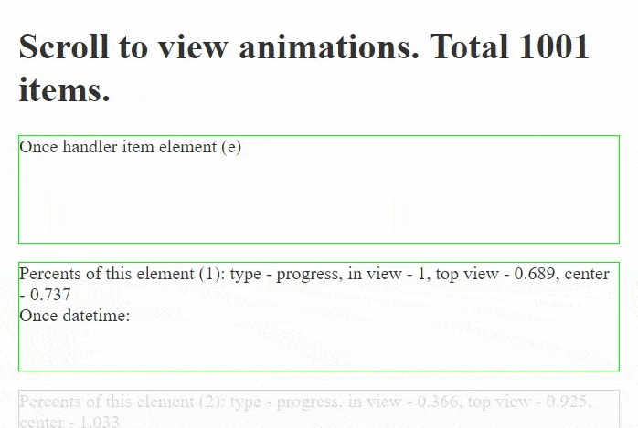

# Check if element is in viewport. Vue.js 2 plugin with SSR support without dependencies. [DEMO](https://vtimofeev.github.io/vue-check-view/index.html)

Simple plugin that checks element position on the screen (viewport) and adds classes to element:

1. In viewport classes: `view-in` and one of [`view-in--gt-half`, `view-in--gt-thrid`, `view-in--full`],
2. Out viewport classes: `view-out` and one of [`view-out--below`, `view-out--above`]

It listens `scroll` and `resize` window events and supports modern browsers (Firefox, Chrome, Edge).
Supports vue.js version 2 and higher.

## Install

```
npm i vue vue-check-view --save
```

```

import checkView from 'vue-check-view'
Vue.use(checkView)

```

or (only for test)

```
<script src="http://vtimofeev.github.io/vue-check-view/plugin.js">
```


## Add directive 'view' to elements

### Example 1, simple

Auto add classes to element

```
<div v-view>
    Content
</div>
```

### Example 2, advanced with use handler

Auto add classes to element and executeHandler

```
<div v-view="viewHandler">
    Content
</div>
```

```
funtion viewHandler (e) {
    console.log(e.type) // 'enter', 'exit', 'progress'
    console.log(e.percentInView) // 0..1 how much element overlap the viewport
    console.log(e.percentTop) // 0..1 position of element at viewport 0 - above , 1 - below
    console.log(e.percentCenter) // 0..1 position the center of element at viewport 0 - center at viewport top, 1 - center at viewport bottom
    console.log(e.scrollPercent) // 0..1 current scroll position of page
    console.log(e.scrollValue) // 0..1 last scroll value (change of page scroll offset)
    console.log(e.target.rect) // element.getBoundingClientRect() result
}
```

### Example 3, once time the handler will be executed when element appears on screen

```
<div v-view.once="onceHandler">
    Content
</div>
```

```
funtion onceHandler (e) {
    console.log(e.type) // 'enter', 'exit', 'progress'
    console.log(e.percentInView) // 0..1 how much element overlap the viewport
    console.log(e.percentTop) // 0..1 position of element at viewport 0 - above , 1 - below
    console.log(e.percentCenter) // 0..1 position the center of element at viewport 0 - center at viewport top, 1 - center at viewport bottom
    console.log(e.scrollPercent) // 0..1 current scroll position of page
    console.log(e.scrollValue) // 0..1 last scroll value (change of page scroll offset)
    console.log(e.target.rect) // element.getBoundingClientRect() result
}
```

## DEMO

### Browser
https://vtimofeev.github.io/vue-check-view/index.html

### Live image
